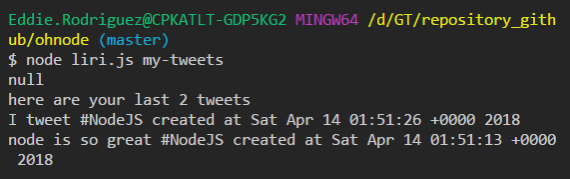

# Title: ohnode
# Contributor: Eddie Rodriguez
## GitHub URL:  https://github.com/erodriguez87/ohnode

This is a simple Node application built to respond to different user commands using a variety of APIs.

Available commands:
"my-tweets" - Calls the twitter API and shows the last 20 tweets in the account and when they were created
"spotify-this-song" - Calls the spotify API and shows information about the song following the command
"movie-this" - Reaches out to the OMDB API and looks for the movie following the command
"do-what-it-says" - this reads a command from a text file on the filesystem and runs the command.

### Packages included

   * [Twitter](https://www.npmjs.com/package/twitter)
   * [Node-Spotify-API](https://www.npmjs.com/package/node-spotify-api)
   * [Request](https://www.npmjs.com/package/request)
   * [DotEnv](https://www.npmjs.com/package/dotenv)

